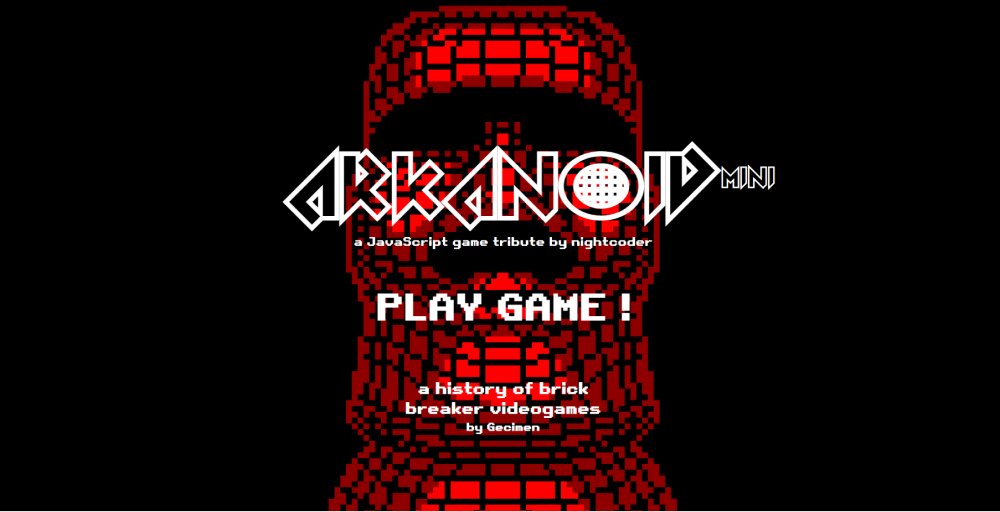

<!--
**newnightcoder/newnightcoder** is a ✨ _special_ ✨ repository because its `README.md` (this file) appears on your GitHub profile.

Here are some ideas to get you started:

- I’m currently working on ...
- 🌱 I’m currently learning ...
- 👯 I’m looking to collaborate on ...
- 🤔 I’m looking for help with ...
-  Ask me about ...
- 📫 How to reach me: ...
- 😄 Pronouns: ...
- ⚡ Fun fact: ...
-->

<!--  -->

# Bonjour! Moi c'est Daniel - alias [Nightcoder](https://twitter.com/Nightcoder2) 😎 👋🏾

## Je suis développeur web frontend

- 🌱 &nbsp;Fier d'avoir appris en autodidacte
- 🚀 &nbsp;À l'écoute du marché - je postule
- 🧠 &nbsp;Je bosse ma capacité à résoudre les problèmes
- 💫 &nbsp;En tant que dev Padawan mon but dans la vie est de devenir un Jedi
- 👨🏾‍💻 &nbsp;En ce moment je travaille sur mon site perso
- ❤️ &nbsp;J'adore le code

## 🛠 &nbsp;Langages + outils que j'utilise

<i>Voir plus</i>

&nbsp;

**<ins>Front</ins>**

&nbsp;&nbsp;&nbsp;&nbsp;&nbsp;&nbsp;&nbsp;&nbsp;&nbsp;&nbsp;&nbsp;&nbsp;&nbsp;&nbsp;&nbsp;&nbsp;&nbsp;&nbsp;

&nbsp;&nbsp;&nbsp;&nbsp;&nbsp;&nbsp;&nbsp;&nbsp;&nbsp;&nbsp;&nbsp;&nbsp;&nbsp;&nbsp;&nbsp;&nbsp;

**<ins>Back</ins>**

&nbsp;&nbsp;&nbsp;&nbsp;&nbsp;&nbsp;&nbsp;&nbsp;&nbsp;&nbsp;

**<ins>Outils</ins>**

&nbsp;&nbsp;&nbsp;&nbsp;&nbsp;&nbsp;&nbsp;&nbsp;&nbsp;&nbsp;&nbsp;&nbsp;&nbsp;&nbsp;&nbsp;&nbsp;&nbsp;&nbsp;&nbsp;&nbsp;&nbsp;&nbsp;&nbsp;  
&nbsp;

## 💻 &nbsp;Quelques projets (finis 😋)

<i>Voir plus</i>

### <ins>FORUM - un réseau social fullstack JS</ins>

<a href="#" target="blank">Voir en live</a> <a href="#" target="blank">Aller au repo</a>

&nbsp;&nbsp;&nbsp;  
&nbsp;&nbsp;&nbsp;&nbsp;

---

### <ins>COLORWAVE - un site d'achat en ligne</ins>

<a href="#" target="_blank">Voir en live</a> <a href="#" target="blank">Aller au repo</a>

&nbsp;&nbsp;&nbsp;

---

### <ins>THINGS - une todo list avec React</ins>

<a href="#" target="blank">Voir en live</a> <a href="#" target="blank">Aller au repo</a>

&nbsp;&nbsp;

---

### <ins>Arkanoid-mini - un jeu hommage en JavaScript</ins>

<a href="#" target="blank">Voir en live</a> <a href="#" target="blank">Aller au repo</a>

&nbsp;&nbsp;&nbsp;

---

## 👀 &nbsp;Trucs qui ont rien à voir

1- je suis un très gros buveur de thé vert à la menthe avec du sucre - ça me rend super éveillé, focus et heureux 🤩 🍵

## 💬 &nbsp;Parlons-nous!

  
  
  
  

