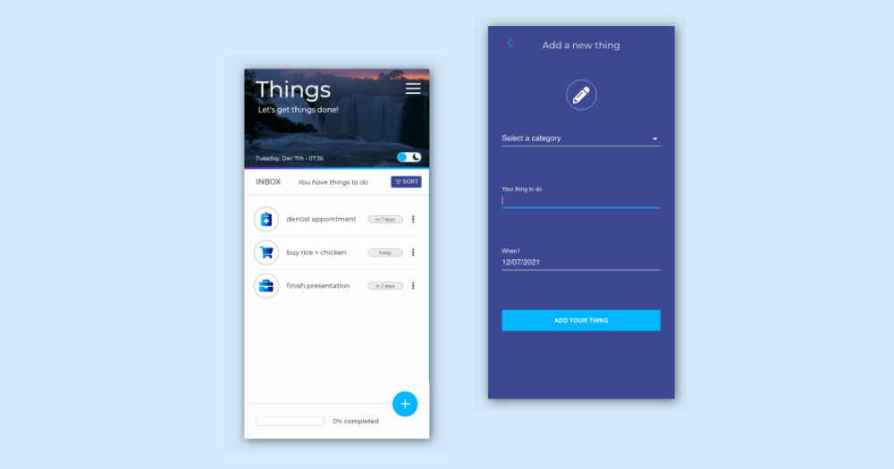

<!--
**newnightcoder/newnightcoder** is a ✨ _special_ ✨ repository because its `README.md` (this file) appears on your GitHub profile.

Here are some ideas to get you started:

- I’m currently working on ...
- 🌱 I’m currently learning ...
- 👯 I’m looking to collaborate on ...
- 🤔 I’m looking for help with ...
-  Ask me about ...
- 📫 How to reach me: ...
- 😄 Pronouns: ...
- ⚡ Fun fact: ...
-->

<!--  -->

# Hello there! I'm Daniel Julien - aka [Nightcoder]() 😎 👋🏾

# I'm a frontend web developer

- 🌱 &nbsp;I'm a proud self-taught dev
- 🚀 &nbsp;Available for hire - i'm applying
- 🧠 &nbsp;Always working on my problem solving skills
- 💫 &nbsp;As a junior my goal is to become a Jedi developer
- 👨🏾‍💻 &nbsp;Currently coding my portfolio website
- ❤️ &nbsp;I love to code

## 🛠 &nbsp;Languages + tools i'm using

**<u>Front</u>**

&nbsp;&nbsp;&nbsp;&nbsp;&nbsp;&nbsp;&nbsp;&nbsp;&nbsp;

&nbsp;&nbsp;&nbsp;&nbsp;&nbsp;&nbsp;&nbsp;&nbsp;&nbsp;

**Back**

&nbsp;&nbsp;&nbsp;&nbsp;&nbsp;&nbsp;&nbsp;&nbsp;&nbsp;&nbsp;&nbsp;&nbsp;

**Tools**

&nbsp;&nbsp;&nbsp;&nbsp;&nbsp;&nbsp;&nbsp;&nbsp;&nbsp;&nbsp;&nbsp;&nbsp;&nbsp;&nbsp;&nbsp;

<!-- &nbsp;&nbsp;&nbsp;&nbsp;&nbsp; -->

&nbsp;

## 💻 &nbsp;Some of the (finished) projects i built

### FORUM - a fullstack JS social media app

<a href="#" target="blank">see project live</a> <a href="#" target="blank">go to repo</a>

&nbsp;&nbsp;&nbsp;  
&nbsp;&nbsp;&nbsp;&nbsp;

---

### COLORWAVE - online shopping cart

<a href="#" target="_blank">see project live</a> <a href="#" target="blank">go to repo</a>

&nbsp;&nbsp;&nbsp;

---

### THINGS - a React todo app

<a href="#" target="blank">see project live</a> <a href="#" target="blank">go to repo</a>

&nbsp;&nbsp;

---

### Arkanoid-mini - a vanilla JS tribute game

<a href="#" target="blank">see project live</a> <a href="#" target="blank">go to repo</a>

&nbsp;&nbsp;&nbsp;

&nbsp;

## 👀 &nbsp;Random facts about me

- 🍵 i'm a heavy mint tea drinker - it makes me awake, focused and happy
  &nbsp;

## 💬 &nbsp;Let's connect!

  

  

