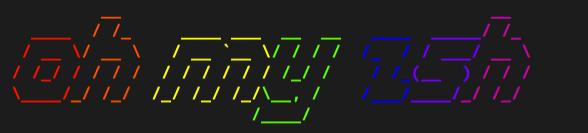

<!--
**newnightcoder/newnightcoder** is a ✨ _special_ ✨ repository because its `README.md` (this file) appears on your GitHub profile.

Here are some ideas to get you started:

- I’m currently working on ...
- 🌱 I’m currently learning ...
- 👯 I’m looking to collaborate on ...
- 🤔 I’m looking for help with ...
-  Ask me about ...
- 📫 How to reach me: ...
- 😄 Pronouns: ...
- ⚡ Fun fact: ...
-->

# Hello 👋🏾 &nbsp;I'm Daniel - aka [Nightcoder](https://twitter.com/Nightcoder2) 😎

  

## I'm a frontend web developer

- 🌱 &nbsp;Proud to be self-taught
- 🚀 &nbsp;Available for hire - i'm applying
- 🧠 &nbsp;Always working on my problem solving skills
- 💫 &nbsp;As a junior dev my goal is to become a Jedi
- 👨🏾‍💻 &nbsp;Currently coding my portfolio website
- ❤️ &nbsp;I love to code

## 🛠 &nbsp;Languages + tools i'm using

<i>Click to see more</i>

&nbsp;

**<ins>Front</ins>**

&nbsp;&nbsp;&nbsp;&nbsp;&nbsp;&nbsp;&nbsp;&nbsp;&nbsp;&nbsp;&nbsp;&nbsp;&nbsp;&nbsp;&nbsp;&nbsp;&nbsp;&nbsp;

&nbsp;&nbsp;&nbsp;&nbsp;&nbsp;&nbsp;&nbsp;&nbsp;&nbsp;&nbsp;&nbsp;&nbsp;&nbsp;&nbsp;&nbsp;&nbsp;

**<ins>Back</ins>**

&nbsp;&nbsp;&nbsp;&nbsp;&nbsp;&nbsp;&nbsp;&nbsp;&nbsp;&nbsp;

**<ins>Tools</ins>**

&nbsp;&nbsp;&nbsp;&nbsp;&nbsp;&nbsp;&nbsp;&nbsp;&nbsp;&nbsp;&nbsp;&nbsp;&nbsp;&nbsp;&nbsp;&nbsp;&nbsp;&nbsp;&nbsp;&nbsp;&nbsp;&nbsp;&nbsp;  
&nbsp;

## 💻 &nbsp;Some of the (finished) projects i built

### <ins>FORUM</ins>

**_A fullstack JS social media app._**  
**_Forum platform inspired by Reddit and Twitter_**

👁&nbsp;&nbsp;<ins>[See live](https://forum-network.netlify.app/)</ins>  
➡️&nbsp;&nbsp;[Go to repo front](https://github.com/newnightcoder/reddit-clone-front)  
➡️&nbsp;&nbsp;[Go to repo back](https://github.com/newnightcoder/reddit-clone-back)

&nbsp;&nbsp;&nbsp;  
&nbsp;&nbsp;&nbsp;&nbsp;

---

### <ins>COLORWAVE</ins>

**_An online shopping site._**  
**_Inspired by Colorware website_**

👁&nbsp;&nbsp;<ins>[See live](https://colorwave-shop.netlify.app/)</ins>  
➡️&nbsp;&nbsp;[Go to repo](https://github.com/newnightcoder/colorwave)

&nbsp;&nbsp;&nbsp;&nbsp;

---

### <ins>THINGS</ins>

**_A React todo app._**

👁&nbsp;&nbsp;<ins>[See live](https://things-7544b.web.app/)</ins>  
➡️&nbsp;&nbsp;[Go to repo](https://github.com/newnightcoder/react-todo-app)

&nbsp;&nbsp;

---

### <ins>Arkanoid-mini</ins>

**_A vanilla JS tribute game._**  
**_My very 1st project ever_** 😅

👁&nbsp;&nbsp;<ins>[See live](https://newnightcoder.github.io/arkanoid-mini/)</ins>  
💀&nbsp;&nbsp;[Go to repo](https://github.com/newnightcoder/arkanoid-mini)

&nbsp;&nbsp;&nbsp;

---

## 👀 &nbsp;Random facts about me

1- i'm a heavy mint tea drinker - it makes me awake, focused and happy 🤩 🍵 
2- i am a bicyle rider only 🚲 - i'm allergic to the subway train + i don't have a driving license because i don't want to drive but i like taxis 🚖 👍🏾 
3- i really love X (twitter) a LOT but i don't think Elon Musk is a genius 💥 😈  
4- i know the world has changed but i still go to SOF from time to time - the nostalgia is real lol [my profile there](https://stackoverflow.com/users/12209569/nightcoder)

## 💬 &nbsp;Let's connect!

  
  
  
  

